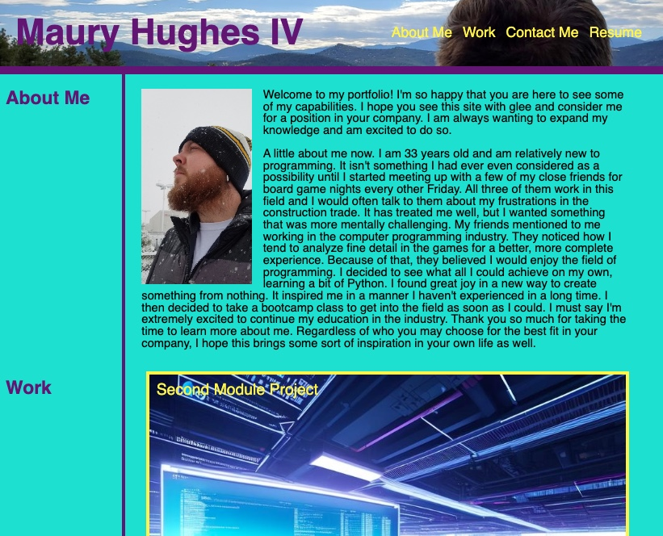

# Portfolio

## Description
This is my portfolio. Everything in yellow is clickable and will take you to the corresponding area, as what is stated by the text. You will be able to see a bit about why I have started this line of work as well as some of my main work for displaying my capabilities.

## Badges
NA

## Visuals

## Installation
NA

## Usage
This is a great resource for determining if I am someone you may want to hire, it provides examples of my capabilities as full-stack developer. https://mauryiv.github.io/my-portfolio/

## Support
NA

## Roadmap
Will continue to update this repository, prioritizing more advanced projects as I continue to learn.

## Contributing
NA

## Authors and acknowledgment
DU coding bootcamp for teaching me how to do these things and having a base goal. As well as some of my fellow students for helping with advice on how to approach certain elements.

## License
Refer to LICENSE

## Project status
Great base, continually updating.
